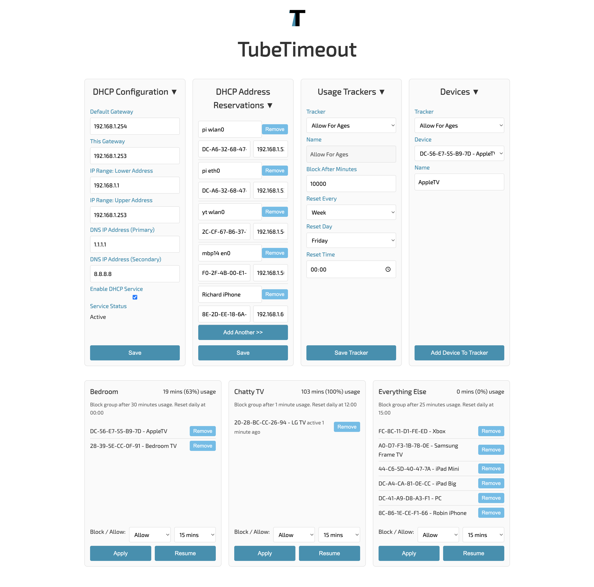

# TubeTimeout

TubeTimeout is a light-weight parental controls app able to keep track of and block YouTube usage on your home network.

## Features

* Count YouTube usage and block access when limits are reached
* Apply daily or weekly time limits to any group of devices
* Works for all devices on your home network
* Simple web UI to configure settings
* No third-party javascript, cloud services or apps required



## Requirements

TubeTimeout runs on low spec hardware like a RaspberryPi Zero2w or Orange Pi Zero3 and works best when there is a wired ethernet connection. 

## Prerequisites

* Disable IPv6 on your home network
* Disable DHCP on your router and let the TubeTimeout device take over (it uses dnsmasq)

## How To Get Started

The following is a rough list of commands required to install TubeTimeout on a vanilla OrangePi Zero3
running Armbian o/s. The reason I chose OrangePi was because it ships with gigabit ethernet.

This has been tested on Armbian 25.5.1 Noble, but should work well with Raspbian o/s on other RaspberryPi devices as well.

Follow the next steps below to learn more about how to configure TubeTimeout.

```
# Run everything as root

sudo su -

# Install packages

apt install -y nftables libnetfilter-queue1 libnetfilter-queue-dev net-tools dnsmasq git

# Install Golang (assumes zsh is your default shell)

wget https://go.dev/dl/go1.23.1.linux-arm64.tar.gz
tar -C /usr/local -xzf go1.23.1.linux-arm64.tar.gz
rm go1.23.1.linux-arm64.tar.gz
echo 'export PATH=$PATH:/usr/local/go/bin:.' >> ~/.zshrc
source ~/.zshrc

# Clone the repo and prevent file ownership warnings

cd /root
git clone git@github.com:relloyd/tubetimeout.git
git config --global --add safe.directory /root/tubetimeout

# Set kernel parameters to enable ip forwarding and more

cat <<EOF > /etc/sysctl.d/local.conf
net.ipv4.ip_forward=1
net.ipv4.tcp_max_syn_backlog=4096
net.ipv4.tcp_fin_timeout=10
net.ipv4.tcp_keepalive_time=60
net.ipv4.tcp_keepalive_intvl=10
net.ipv4.tcp_keepalive_probes=5
net.ipv6.conf.all.disable_ipv6=1
net.ipv6.conf.default.disable_ipv6=1
net.ipv4.tcp_retries2=5
net.core.rmem_max=8388608
net.core.wmem_max=8388608
net.ipv4.udp_rmem_min=8192
net.ipv4.udp_wmem_min=8192
net.core.netdev_max_backlog=5000
EOF

# Configure journal config to limit disk space usage

mkdir -p /etc/systemd/journald.conf.d
cat <<EOF > /etc/systemd/journald.conf.d/custom.conf
[Journal]
Storage=persistent
SystemMaxUse=50M
SystemKeepFree=100M
SystemMaxFileSize=10M
MaxRetentionSec=1month
EOF

# Disable the default resolver as we set this in Go code per network device using nmcli
# This symlink is in place by default: /etc/resolv.conf -> /run/systemd/resolve/stub-resolv.conf
# We replace it below, but the tubetimeout generated dnsmasq.conf will tell it to use no-resolv anyway

systemctl disable --now systemd-resolved
rm /etc/resolv.conf
echo "nameserver 127.0.0.1" > /etc/resolv.conf

# Ensure dnsmasq is stopped before running "make install" so tests can pass

systemctl stop dnsmasq.service

# Install TubeTimeout

make install
make daemon

# Set the red status light on OrangePiZero3

echo "stmmac-0:01:1Gbps" | tee /sys/class/leds/red:status/trigger
echo "none" | tee /sys/class/leds/red:status/trigger
echo 1 | tee /sys/class/leds/red:status/brightness

# Configure the hostname and reboot to pick up the new kernel parameters etc

hostnamectl hostname tubetimeout
reboot
```

## Next Steps

Learn how to use the UI and configure TubeTimeout by reading documentation here:

https://www.tubetimeout.com/post/how-to-set-up-tubetimeout

After your device reboots, load the UI here:

http://tubetimeout.local

I'd welcome any PRs and suggestions you may have. Good luck and best wishes,

_Richard_
